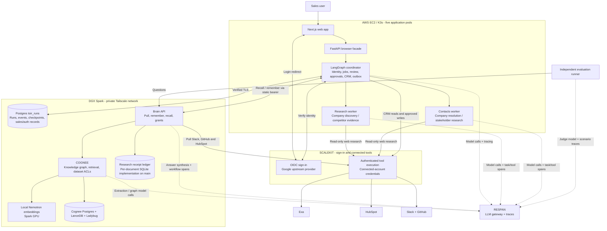

# Team Submission

Coverage: functionality on GitHub `main` through `a32aea9`, including the GPT-5 mini rollout, increased research budgets, enabled continuous prospecting and stricter model-report handling. Implementation, recorded evaluations and live deployment evidence are distinguished below; the latest code is not assumed to be deployed on every service.

## Team

- Team name: Toir Inc (confirmed)
- Participants: Curran McLaughlin, Jared Lyon (confirmed)
- Company Brain / project name: Toir FDE Brain: the institutional memory of a forward-deployed-engineering firm

## Company Brain Overview

Toir Inc is (role-played as) an FDE shop embedded with three clients: Acme Logistics, Globex Health and Initech Finance. Its knowledge is split across client Slack channels, per-client GitHub repos and the HubSpot CRM, where deals, contacts and SOW/contract notes live. The brain pulls all three through Scalekit connected accounts, remembers them into Cognee as per-client **engineering** and **commercial** datasets, and answers cross-source questions such as "who owns the Acme rollout, what blocks go-live, and what did the SOW promise?". The engagement lead sees Acme/Initech engineering and all commercial datasets. The FDE engineer sees Globex engineering and shared firm/pipeline knowledge, but no commercial terms. Staffing someone onto a client is a live grant.

- Data sources connected through Scalekit (≥ 2 apps): Slack, GitHub, HubSpot, plus Exa for fresh public-web research.
- Primary use cases / team workflows: permission-aware client-engagement Q&A and pre-call briefs; public prospect discovery and contact research; human-reviewed HubSpot updates; accepted research saved back into company memory. GitHub issue triage is an evaluation scenario awaiting its action endpoint, not a completed write-back integration.
- Users in the demo and how their access differs: `jared@neptuneops.com` (engagement lead on Acme + Initech, firm principal: all commercial datasets plus Acme/Initech eng). `curran@toirinc.com` (FDE engineer on Globex: `globex-eng`, `toir-firm`, `toir-pipeline`).
- What makes it stand out:
  - Two-layer access: per-client eng vs commercial datasets.
  - The API tells the agent what it couldn't see (client, layer, owner) without leaking content, so the agent can route an access request.
  - A Spark-hosted Cognee with local Nemotron embeddings.
  - A working sales workspace connects fresh, cited public research to versioned CRM proposals and reusable company memory.
  - Human approval, CRM execution and memory delivery are independently persisted and visible; a model response cannot authorize a write.

## Product Workflow Implemented on Main

The application has a Next.js/React/TypeScript frontend, a browser-facing FastAPI facade, a Python LangGraph coordinator, and two separate Bun/Oh My Pi workers. The coordinator owns durable state; workers own temporary bounded research sessions.

1. **Sign in and retain your workspace.** Google sign-in runs through Scalekit. Verified sales members get server-backed conversations, messages, jobs and Tasks in a responsive light/dark interface. Settings → Profile lists their active browser sign-ins and supports revoking one or all of them. Reloading or leaving a conversation does not discard accepted work.
2. **Ask for research.** Chat routes requests into company discovery, named-company resolution, contact enrichment, an answer from shared memory, or clarification. Requests retain the requested company count (1–10); explicit company-only requests skip contact enrichment. Ambiguous company identities are presented for selection.
3. **Review grounded findings.** The research worker finds US companies, recent leadership/funding/partnership signals and documented business needs, plus cited competitor marketing, advertisements, pricing and customer relationships where evidence exists. The separate contacts worker resolves identities and researches up to five purchasing stakeholders. The `/research` workspace provides run history, progress, cancellation/retry, company results, market context, source links and the original retrieved text.
4. **Prepare a CRM proposal when requested.** For explicit chat work, research alone does not create a CRM proposal; an add/update/save-to-CRM request does. The coordinator reads HubSpot and prepares company/contact creates or updates, associations and notes. The same versioned proposal appears in the conversation and Tasks, with supported evidence and the current CRM baseline.
5. **Approve a specific version.** Users can exclude contacts, operations or fields before approving or denying. Edits create a new version; decisions are atomic and immutable. Execution verifies that the exact approved contents still match, journals each returned CRM ID, skips completed operations on retry, and requires renewed review if the CRM baseline changes. An uncertain create is reconciled before another attempt.
6. **Remember accepted work.** Sourced discovery/contact findings and proposal outcomes enter a durable memory outbox for `toir-pipeline`. Research-only reports can sync without creating or approving a CRM proposal. Shared recall helps plan later work, but remembered claims require fresh public verification before qualifying as new research evidence.

### Continuous prospecting and bounded execution

- Continuous prospecting is an opt-in durable scheduler. New installations start disabled; the deployed workspace was explicitly enabled after the GPT-5 mini rollout. Explicit chat work has priority. One discovery slot and one contact slot can run concurrently; pending approvals occupy neither slot.
- Default background limits are 10 discovery batches and 25 enrichment attempts per Los Angeles day, a fit threshold of 70, and US companies with 20–1000 employees. Provider, auth, storage and memory readiness gate continuous dispatch.
- Each research/contact task has cumulative limits of 60 searches, 200 retrieved-page slots, 60 research model turns and a ten-minute absolute deadline, including follow-up work and failed provider attempts. Coordinator planning/review calls are tracked separately. Only the three read-only Exa tools are registered in the workers; they have no CRM write or database access.
- Workers use low reasoning and a 16,384 completion-token budget. Model context uses bounded evidence excerpts while the source registry retains original text; token thresholds reserve a final report turn before the configured input ceiling. Pending proposals are reused by company domain, with seven-day research and 30-day denial suppression for background work; explicit requests can override those repeat-work limits.
- Worker final reports use enforced JSON output. Per-candidate schema isolation drops malformed candidates while retaining independently valid findings, without inventing missing values or relaxing citation checks. Truncated or ambiguous final JSON is rejected.
- Source IDs derive from canonical URLs, and citation quotes must match the retrieved text. Deterministic validation checks identity, company size and dated signals; model-assisted review checks whether the evidence actually supports each claim. Unsupported fields are dropped, and proposed use cases/outreach angles stay labeled as hypotheses. No prospect outreach is sent.
- The LangGraph research workflow performs planning, research, evidence review and up to two follow-up passes before report finalization. The latest budget fix preserves an already reviewed report when a follow-up exhausts its usage budget, marks the limitation and stops further paid work. It does not disguise unrelated provider failures as success.
- Lost worker sessions and interrupted work remain visible and require explicit retry. Retries retain their parent run and saved evidence; the original result is preserved.

Implementation: [research workflow](../apps/orchestrator/graph/workflow.py), [evidence review](../apps/orchestrator/graph/evidence.py), [sales coordinator](../apps/orchestrator/sales/), [research worker](../agents/research/README.md), [contacts worker](../agents/contacts/README.md), and [browser API contract](../coms/prospecting-contract.md). Older rollout notes in the contract are superseded by the deployment evidence below.

## The Three Layers

### Pull — Scalekit

- Connections created (`connection_name` → app): `slack` → Slack (Toir Inc workspace), `github-connect` → GitHub (org `Toir-FDE-Team`), `hubspot` → HubSpot, `exa` → Exa (shared account identifier `toir`).
- Tools called: `slack_list_channels`, `slack_list_users`, `slack_fetch_conversation_history`, `slack_get_conversation_replies`, GitHub issues/comments/PR/readme list tools, HubSpot company/deal/contact/note read tools
- How source users are identified: for Brain's Slack/GitHub/HubSpot connections, the Scalekit `identifier` **is** the Cognee user email. Each source container (channel / repo / company) routes to exactly one dataset with a fixed owner; the pull uses the owner's connected account when ACTIVE, otherwise the other user's. The workers' shared Exa identifier is `toir`.
- Research tools: `exa_search`, `exa_crawl`, `exa_find_similar`. Both workers use Scalekit's authenticated tool execution; the direct Exa key stays in the setup secret/Scalekit vault, not in worker pods.
- Write-back actions: the coordinator uses Scalekit for approved HubSpot company/contact operations, associations and notes. Both sales users use Toir's shared HubSpot connection owned by `curran@toirinc.com`; requester and approver remain separate audit identities. Workers cannot write CRM records. GitHub issue creation is not wired into the current application.
- Sign-in: Google is the upstream login provider and Scalekit is the OIDC issuer. The coordinator validates PKCE/state/nonce and signed identity claims, admits configured verified members, and issues an opaque eight-hour server-managed session. Google Drive/Gmail scopes and provider refresh tokens are not requested. Browser sessions have revocable public IDs; only cookie hashes are stored, and mutations require the configured browser Origin.
- Identity boundaries: browser login, external connected-account identity and Cognee permissions serve different purposes. Signing in does not grant client datasets or borrow another user's memory identity. Source pulls may use the owner's ACTIVE connection or the documented fallback; source access does not by itself determine which users may later recall an ingested dataset.
- Code entry points: [source pulls](brain/scalekit_pull.py), [Exa transport](../agents/research/src/tools/scalekit.ts), [HubSpot adapter](../apps/orchestrator/sales/crm.py), [login](../apps/orchestrator/sales/auth.py), and [durable sign-ins](../apps/orchestrator/sales/auth_sessions.py).

### Remember — Cognee

- Permanent graph: pulled Slack channel transcripts (one line per message with channel/author/timestamp), GitHub issues/PRs with comments, HubSpot companies with deals/contacts/notes, and accepted research leads with nested contacts, workflow state and source evidence. Pulled source documents carry a `[[source=…; container=…; client=…; layer=…; title=…; url=…]]` provenance header; research documents preserve the complete lead, original report sources and cited source records.
- Session memory: agent conversation turns (`session_id`) only. Never cognified into the graph.
- `node_set` tags: `source:<slack|github|hubspot|research>`, `client:<acme|globex|initech|toir>`, `layer:<eng|commercial|firm>`, `container:<channel|repo|company>`
- Datasets and who owns / can read each:

  | dataset | owner | also readable by |
  |---|---|---|
  | `acme-eng`, `initech-eng` | jared | (live grant demo: `acme-eng` → curran) |
  | `acme-commercial`, `initech-commercial`, `globex-commercial` | jared | — |
  | `globex-eng` | curran | — |
  | `toir-firm` | jared | curran |
  | `toir-pipeline` | jared | curran (read + write) |

- Access control: `ENABLE_BACKEND_ACCESS_CONTROL=true`. Each user+dataset gets its own Ladybug graph and LanceDB store. Grants and revokes go through `authorized_give/revoke_permission_on_datasets`.
- Beyond defaults:
  - Custom FDE graph model (Client, Person, Deal, SOW, Commitment, EngineeringRequest, Deployment, Decision) with identity fields and a prompt that preserves explicit facts and provenance. Source pulls run `improve()`; the durable research-ingestion path excludes automatic improvement so extra model work cannot obscure completion receipts.
  - `GRAPH_COMPLETION` per readable dataset, then a single synthesis over only the permitted context.
  - Local Nemotron-embed-1B (2048-d) on a DGX Spark; Postgres for Cognee's relational store.
- Code entry point: `brain-api/brain/memory.py`, `brain-api/brain/graph_model.py`

### Durable research-to-memory delivery

- The coordinator checks authenticated `/capabilities` and both users' `/access/<email>` grants before ingestion. Research writes resolve the owner's canonical `toir-pipeline` dataset ID and use the actual requesting user after read/write authorization checks. Curran has pipeline read/write access; no private client grants are added by this workflow.
- The outbox sends an immutable report with a stable SHA-256 ingestion ID in both `Idempotency-Key` and `report.ingestion_id`. The report retains run/session/requester links, source text, nested contact evidence, proposal/version/decision/execution metadata and CRM results where present. A changed report is a new event; retries keep the same ID and payload.
- Only an explicit acknowledgment with the matching `ingestion_id`, `dataset: toir-pipeline` and a positive document count marks memory synced. The UI separates research completion from `not_requested`, `pending`, `synced` or `blocked` memory status. An unavailable Brain does not erase findings, approvals or CRM execution history.
- On `main`, Brain API uses a persistent SQLite receipt ledger independent of Cognee's relational/vector/graph stores. Per-document start/completion records survive restart; matching completed requests replay their acknowledgment without another ingestion call, while changed payloads under the same ID conflict. Caller disconnects do not cancel the tracked ingestion task.
- A crash or unconfirmed Cognee result marks an ingestion uncertain and requires reconciliation; it is never blindly replayed or called complete. This is durable idempotency, not a transaction spanning every Cognee store. The authenticated status route exposes receipt progress. Existing JSON acknowledgment IDs are retained as protected legacy entries requiring reconciliation, and forgetting pipeline data invalidates its receipts.
- Shared sales conversations recall only `toir-firm` and `toir-pipeline` material readable by **both** sales members, while preserving the requester's email. Direct Brain Q&A retains each user's individual client-dataset access. Private commercial context is not copied into a shared sales conversation.

Implementation: [coordinator outbox and recall](../apps/orchestrator/sales/brain.py), [research API](brain/research_api.py), [ingestion service](brain/research_ingestion.py), [receipt ledger](brain/research_ledger.py), and [recovery contract](README.md#durable-research-ingestion). The recorded Spark deployment still used its earlier JSON acknowledgment implementation; the newer per-document ledger on `main` needs a coordinated Spark upgrade.

### Act + Evaluate — your agent(s) + Respan

- Agent(s) and the task each performs:
  - LangGraph coordinator: interprets chat, plans discovery, reviews evidence, schedules workers, prepares approval-controlled CRM operations, and recalls/syncs shared company memory.
  - Oh My Pi research worker: public company discovery and competitor evidence. Separate contacts worker: company resolution and stakeholder enrichment. Both use Exa through Scalekit.
  - The brain itself answers `/recall`.
- LLM calls routed through the Respan gateway? Yes. Current coordinator/worker configuration and Brain text-generation/judging code use `gpt-5-mini` through `https://api.respan.ai/api/`, with low reasoning and explicit completion budgets. Worker direct-provider fallbacks are disabled. The EC2 application model rollout is verified; Spark's running Brain model switch is deferred, so its loaded configuration and the historical evaluation models must not be relabeled. Nemotron embeddings stay local on Spark.
- Public agent evidence: [research run in Respan](https://api.respan.ai/api/3f37a437-bd40-4bcb-9e37-f5f2686d5622/traces/5902a7809174a2f5b7bf2967156717ca/) (23 spans, 5 LLM calls). This historical trace is research evidence, not proof of a CRM mutation.
- How the runs are traced:
  - Coordinator: `respan-ai` plus LangChain instrumentation, with content capture disabled.
  - Workers: OpenTelemetry task/tool and native SDK GenAI spans exported to Respan, with propagated W3C trace context and run/task identifiers. Custom attributes omit prompt/source content and credentials.
  - Brain/evaluation: `respan-ai` workflow/task spans for `brain.pull`, `brain.remember`, `brain.recall`, `brain.recall.graph`, `brain.synthesize` and `eval.scenario`, with scenario/run labels and expected/output metadata for evaluations. The unpublished Cognee Respan adapter is not required.
- Scenario file: `brain-api/eval/scenarios.json` (**14 scenarios: 7 Q&A, 4 access, 1 grant, 2 action**). The 11 Q&A/access scenarios form the recorded before/after comparison. The grant scenario was run separately; the two GitHub action scenarios remain pending their agent endpoint.
- Evaluator:
  - Deterministic Python checks: every `must_mention` present, no `must_not_mention` leak, `expected_sources` ⊆ returned `source:*` tags.
  - Independent LLM judge `gpt-5-mini` via the Respan gateway. Current code uses low reasoning and an 8,192 completion-token budget without a temperature parameter; the stored before/after results retain their original run configuration.
  - Neither is the agent.
- Code entry points: [coordinator model gateway](../apps/orchestrator/integrations/models.py), [worker telemetry](../agents/research/src/telemetry/respan.ts), [Brain configuration](brain/config.py), and [evaluation runner](eval/run.py).

## Evaluation Evidence

### Baseline Run

- Respan trace: [public baseline s01](https://api.respan.ai/api/3f37a437-bd40-4bcb-9e37-f5f2686d5622/traces/042daa65fe1d2060f8aacce699f5b112/). In the Respan platform, filter Logs → Traces by `run_label=before`.
- Scenarios run: 11 (grant run separately; 2 action scenarios skipped pending an agent endpoint).
- Mean score: **4/11 pass**; judge mean 0.48; must-mention coverage 0.74
- Worst scenario and why it failed:

```text
question: What date does the Globex clinical pilot SOW specify?
expected: 2026-11-16 (source:hubspot)
got:      "I cannot answer… the context contains no SOW"  (SOWs live only in HubSpot notes)
score:    judge 0.0, mention 0/1
```

### Improved Run

- Respan trace: [public improved s01](https://api.respan.ai/api/3f37a437-bd40-4bcb-9e37-f5f2686d5622/traces/d68d3cbef3f7ae98b9dc3b0a3ac0e907/). In the Respan platform, filter Logs → Traces by `run_label=after`.
- What changed: **Added HubSpot (CRM: deals, contacts, SOW notes) as a third Scalekit source.** Same code, same questions.
- Mean score: **11/11 pass**; judge mean 0.64; must-mention coverage 1.00

```text
Before:  pass = 4/11   judge mean = 0.48   (n = 11 scenarios)
After:   pass = 11/11  judge mean = 0.64   (n = 11 scenarios)
Grant scenario s11 (curran, after acme-eng grant): PASS, judge 1.0
```

Results: `brain-api/eval/results/{before,after,grant}.json`.

These are recorded company-brain Q&A/access evaluations, not new public prospecting acceptance runs or proof of live CRM writes. The three public Respan URLs in this submission were checked without authentication and returned HTTP 200 JSON. Action scenarios `s12` and `s13` require a GitHub triage endpoint that is not implemented and remain unscored. The chosen action demonstration is the existing version-approved HubSpot workflow; it is not counted as a passing GitHub action evaluation.

## Access Story

- User A: `jared@neptuneops.com`. Recorded source connections: slack, github-connect. Readable: all `*-commercial`, `acme-eng`, `initech-eng`, `toir-firm`, `toir-pipeline`.
- User B: `curran@toirinc.com`. Recorded source connection: hubspot; pulls fall back to Jared for GitHub until Curran's connection is ACTIVE. Readable: `globex-eng`, `toir-firm`, `toir-pipeline`. Both GitHub invitations were accepted during submission preparation: `curranToir` can access `globex-clinical-rag` and `toir-playbooks`; an authenticated lookup of `acme-agent-rollout` returns 404. GitHub repository membership is verified, while authorizing Curran's separate Scalekit GitHub connection remains optional and is not implied by accepting the invitations.
- Slack pulls use Jared's shared source connection for all seven channels. The demo does not claim a Slack-token access difference between the two users; Cognee dataset ACLs enforce the recall boundary after ingestion.
- Question asked by both: "Who owns the Acme rollout and what is blocking go-live?"
- Result for A: Maya Chen (Acme technical DRI). The duplicate-shipment replay bug blocks go-live (dedupe on `shipment_id` + `event_version`; rollback above 0.2% for 15 min). Go-live 2026-11-02 per the signed SOW. Sources: github, hubspot, slack.
- Result for B before the share: no Acme information, and `withheld: [{client: acme, layer: eng, owner: jared@…}, {client: acme, layer: commercial, owner: jared@…}]`, so the agent can ask Jared for access instead of guessing.
- The grant: Jared → Curran, `read` on `acme-eng` (`POST /grant`)
- Result for B after the share: the same owner and blockers, from github + slack. The SOW go-live date is **still absent** and `withheld` still lists `acme commercial`. The engineering grant does not expose commercial terms. `POST /revoke` closes it again.

## Architecture



Arrows show request/dependency direction; dotted arrows highlight Respan calls. The receipt ledger depicts the current `main` implementation; the deployment distinction is documented below.

| System | Where we use it | Boundary |
|---|---|---|
| **Scalekit** | Google-backed browser sign-in; Exa for both workers; source pulls for Brain; HubSpot reads and approved writes | Connected accounts control external app access. Application membership and proposal approval remain coordinator responsibilities. |
| **Cognee** | Company graph ingestion, permission-aware recall, session memory and shared prospecting knowledge | Dataset permissions control recall/write access. Transactional jobs, approvals and CRM execution stay in the coordinator's Postgres store. |
| **Respan** | Coordinator, research/contact workers, Cognee/Brain model traffic, telemetry and independent evaluation judging | Local Nemotron embeddings are separate from the LLM gateway. |

### Deployment and persistence

- One dedicated AWS `t3.medium` runs K3s with web, API, coordinator, research and contacts pods. Internal network policies restrict facade/coordinator/worker paths. Workers and the coordinator have no public ingress route; the app uses private Tailscale HTTPS, with SSM for administration and a localhost tunnel option.
- The coordinator alone receives database and Brain credentials. Respan and Scalekit secrets are synchronized from AWS Secrets Manager into only the services that need them; web/API receive no provider credentials. The Brain API uses a static bearer over Tailscale, not Scalekit M2M authentication.
- Spark hosts two separate relational concerns: `toir_runs` for transactional application state and LangGraph checkpoints; `cognee` for Brain metadata and permissions. Cognee graph/vector files and the local embedding service also live on Spark. The receipt ledger is a separate durable acknowledgment store, not a replacement for those stores.
- Local development can use SQLite. Production cutover stages the Postgres configuration, backs up both stores, drains/stops the coordinator writer, imports terminal research and sales/auth/outbox records, and verifies hashes before selecting Postgres. Existing SQLite checkpoint blobs stay in backup; new work uses the Postgres checkpointer.
- Postgres backup tooling uses a pinned PG17 client, a consistent snapshot, full table hashes and encrypted S3 objects. Application rollback preserves the selected Postgres backend; missing credentials do not silently activate stale SQLite. Brain backup/recovery must preserve the receipt ledger and Cognee stores together.

## Implementation and Live Verification

The following is checked-in evidence, not a claim that every path was rerun for this submission:

| Area | Recorded result | Qualification |
|---|---|---|
| Brain knowledge/access demo | Before 4/11 → after 11/11; separate grant scenario passed; live grant/withhold/revoke demo recorded | [Evaluation JSON](eval/results/) and [Brain status](../coms/brain-api-status.md). The two action scenarios are pending. |
| Prospecting/CRM implementation | Local Python workflow, scheduler, CRM, persistence, authorization and evidence checks; 13 contacts + 21 research Bun tests; browser proposal/edit/approval smoke | [Implementation report](../coms/prospecting-implementation.md). Providers were faked for mutation tests; live HubSpot reads and 11 tool catalog entries were checked. |
| Google sign-in/session management | Recorded 374-pass Python suite, 14 browser contract tests, production frontend build and isolated live Google sign-in/session revocation | [Auth handoff](../coms/auth-handoff.md); this is its recorded validation snapshot, not the test count for the latest combined main. |
| Deployed application | Five healthy deployments, private HTTPS health from a second tailnet device, normal Google/Scalekit sign-in verified | [Runtime handoff](../coms/spark-runtime-integration.md), release `8c0fb9cadeaf-02703df864ec`. |
| Latest model and prospecting rollout | Release `b9730136262d-7eae5ee824ee` uses GPT-5 mini; a live gateway probe succeeded; all five deployments passed readiness; research limits increased | [Latest rollout record](../coms/spark-runtime-integration.md#requested-model-and-prospecting-update). Spark's model/configuration was deliberately left unchanged. |
| Continuous prospecting | Enabled in the authenticated app; third automatic run `86d400a7-0c6d-4a47-8f46-8d18033a0195` completed with one accepted company, ten sources and six valid citations | [Continuous prospecting session](https://toir-hackathon.taild4c940.ts.net/#chat/284510b7-eef4-5474-8520-a0d0628e9642). The first two malformed-report runs remain failed; contact enrichment and the exact memory receipt still need live verification. |
| Model-report reliability | JSON output enforcement and isolated candidate validation; recorded 65 worker tests and both TypeScript checks passed; backend suite 385 passed with 46 environment-dependent skips | [Runtime handoff](../coms/spark-runtime-integration.md). These are reported checks for that implementation, not tests rerun for this documentation edit. |
| HubSpot permissions | ACTIVE connection, real company/contact reads, required tool availability and connected-app company/contact write grants verified | Deployment attestation is enabled. This proves provider readiness, not that a CRM mutation succeeded. |
| Production persistence | TLS 1.3 Postgres connection; cutover preserved 2 historical runs, 29 events and 1 sales record with matching hashes | Same runtime handoff; these are historical records, not newly successful prospecting runs. |
| Backup and rollback | Actual encrypted S3 Postgres backup restored into isolated PostgreSQL 17; all nine table counts/hashes matched; application rollback retained Postgres and history | [Runtime handoff](../coms/spark-runtime-integration.md) and [Postgres operations](../infrastructure/deployment/POSTGRES.md). |
| Spark research-memory handshake | Running capabilities advertise ingestion and both sales members; Curran pipeline reads and the earlier completed-ack retry behavior were verified | Running Spark used `research_ingestions.json`; the new per-document ledger/status implementation is on `main`, awaiting coordinated upgrade. |

Remaining boundaries are explicit: live HubSpot mutation acceptance is pending, even though provider write permissions and deployment attestation are verified. `SCALEKIT_HUBSPOT_WRITE_SCOPES_VERIFIED` defaults false for new configurations and never replaces per-proposal approval. The first fresh research acceptance request retained four reviewed companies but failed on follow-up page-budget exhaustion. The fix and larger budgets are deployed; that failed run is not rewritten as a successful run. A later automatic discovery completed, while its contact enrichment and exact Cognee receipt remain unverified. GitHub issue/Slack-post execution are not implemented by the application. No new live CRM mutation was performed as part of this submission update.

## Reproduction

```bash
cd brain-api
cp .env.example .env            # fill RESPAN_API_KEY, SCALEKIT_*, BRAIN_API_TOKEN, POSTGRES_PASSWORD
docker compose up -d            # Postgres (pgvector) + vLLM Nemotron embed
python3 -m venv .venv && .venv/bin/pip install -e .
# One-time relational setup if the cognee database does not exist:
# docker exec oct7-rag-db-1 createdb -U rag cognee
# Use a fresh demo instance, with no API or other CLI writer running:
.venv/bin/python -m brain pull --as-user jared@neptuneops.com --sources slack github --from-recorded
.venv/bin/python -m brain serve
```

With that server running, use another terminal in `brain-api/`:

```bash
.venv/bin/python eval/run.py --label before
```

Stop the Brain server before the next CLI pull, then start it again:

```bash
.venv/bin/python -m brain pull --as-user curran@toirinc.com --sources hubspot --from-recorded
.venv/bin/python -m brain serve
```

In the evaluation terminal:

```bash
.venv/bin/python eval/run.py --label after
./demo.sh                       # live access story: ask → withheld → grant → ask → revoke
```

Use the Spark setup in [README.md](README.md); a different host needs suitable Brain bind/base URLs and a compatible embedding service. The before baseline must start without previously ingested HubSpot data. Recorded pulls remove the need for SaaS source accounts, but graph ingestion, synthesis and judging still require Respan access and a working embedding endpoint. Keep one Brain writer active at a time; the earlier background-server/CLI-pull combination is not supported.

Environment variables required: see `brain-api/.env.example` (every key listed). No embedding key is needed when using the local Nemotron server. To use the gateway instead, set `EMBEDDING_PROVIDER=custom`, `EMBEDDING_ENDPOINT=https://api.respan.ai/api`, `EMBEDDING_MODEL=openai/text-embedding-3-large`, `EMBEDDING_DIMENSIONS=3072`.

Judges without our SaaS accounts: `brain-api/data/recorded/` holds the raw Scalekit responses, and `brain-api/seed/world.json` holds the full fictional world (all content is synthetic).

### Run or inspect the full application

- Repository-root application setup: [README](../README.md). Use Node 24, Python 3.12 and the pinned Bun dependencies for the two workers. Existing demo fixtures are not live application records or approvals.
- Configure the existing Scalekit/Respan credentials, `SALES_PUBLIC_URL` and its exact Scalekit callback, the shared HubSpot connection and Exa account. The coordinator additionally needs verified-TLS `DATABASE_URL`, `BRAIN_API_URL` and `BRAIN_API_TOKEN`. Verify Brain capabilities and both pipeline grants before expecting memory delivery.
- Deployment, drain, cutover and rollback: [runtime integration](../coms/spark-runtime-integration.md), [Postgres operations](../infrastructure/deployment/POSTGRES.md) and [operator guide](../docs/operations.md). Provisioning is an explicit operator step, not required to inspect the checked-in evidence.
- Authenticated app: [private tailnet HTTPS](https://toir-hackathon.taild4c940.ts.net); requires tailnet membership and an allowed Google identity. The Brain graph is also tailnet-only. Neither is a public judge link.

Representative local checks from the repository root (dependencies installed):

```bash
uv run --frozen pytest -q                # configure TEST_DATABASE_URL for Postgres coverage
uv run --frozen pytest -q brain-api/tests # offline ingestion/receipt tests
uv run --frozen ruff check apps tooling infrastructure/deployment/scripts
npm run test:web:coms
npm run typecheck:web
npm run build:web
bun test agents/research/tests agents/contacts/tests
```

## Demo

- Local instructions: `brain-api/demo.sh` against the Spark API; graph view at `/graph?dataset=acme-eng`
- 3-minute pitch outline:

```text
1. Toir: FDE firm; knowledge scattered across client Slack, client repos, HubSpot
2. Pull: /pull as Jared (Slack+GitHub) and Curran (HubSpot): Scalekit identifiers
3. Brain: Cognee graph (/graph) + the Acme cross-source answer (Slack owner + GitHub blocker + HubSpot SOW date)
4. Access: Curran asks → withheld; Jared grants acme-eng → answered; SOW terms stay hidden; revoke
5. Agent: signed-in sales chat → bounded public research via Scalekit Exa → cited findings → Tasks proposal
6. Eval: 4/11 → 11/11 after adding HubSpot; traces + judge scores in Respan
7. Close the loop: show proposal approval vs execution vs memory status; explain the implemented opt-in prospecting scheduler
```

Only demonstrate a live HubSpot write after provider readiness and an explicit application approval. Use the recorded workflow evidence when that path is not ready; do not substitute the pending GitHub action scenario for a completed demo. Settings → Profile can additionally show durable browser sign-ins and revocation.

### Concrete action demonstration

Use the existing **HubSpot company/contact proposal workflow**. In a signed-in sales conversation, request research on a specific company and preparation of CRM updates. Open the resulting task, inspect its sources and exact changed fields, exclude unwanted contacts/operations, and approve that persisted version. Show execution separately from the decision: successful operations expose their returned HubSpot IDs, while memory sync has its own status. No outreach or Slack messages are part of this demonstration. A prepared proposal, an approved decision and a successful external write are distinct outcomes and must be presented as such.

The current submission includes verified provider permissions and local approval/execution tests. The action procedure is ready for a signed-in demo, but a successful live mutation is not represented as already demonstrated.

## Links

- [Repository](https://github.com/curranToir/october-7-th-hack-a-ton): full application plus `brain-api/`.
- Public Respan traces: [before s01](https://api.respan.ai/api/3f37a437-bd40-4bcb-9e37-f5f2686d5622/traces/042daa65fe1d2060f8aacce699f5b112/), [after s01](https://api.respan.ai/api/3f37a437-bd40-4bcb-9e37-f5f2686d5622/traces/d68d3cbef3f7ae98b9dc3b0a3ac0e907/), and [research run](https://api.respan.ai/api/3f37a437-bd40-4bcb-9e37-f5f2686d5622/traces/5902a7809174a2f5b7bf2967156717ca/).
- [Seeded world](seed/world.json), [scenario definitions](eval/scenarios.json), [recorded results](eval/results/), and [recorded source responses](data/recorded/).
- [Architecture](../docs/architecture.md), [sales workflow contract](../coms/prospecting-contract.md), [Google/session implementation](../coms/auth-handoff.md), and [latest recorded runtime evidence](../coms/spark-runtime-integration.md).
- [Cognee technical feedback](cognee-feedback.md): reported integration issues, implemented workarounds and concrete improvements, without private data or invented incident timings.
