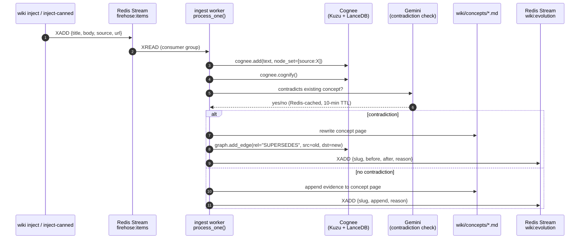
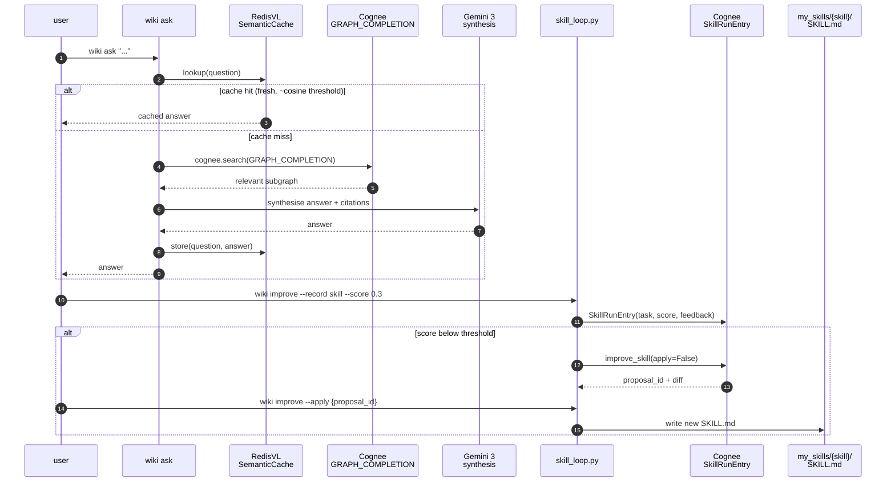
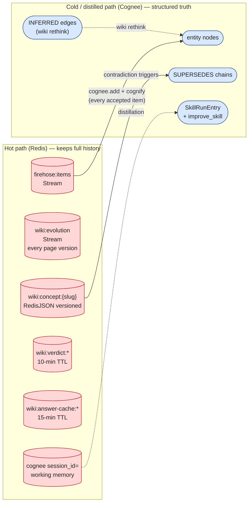
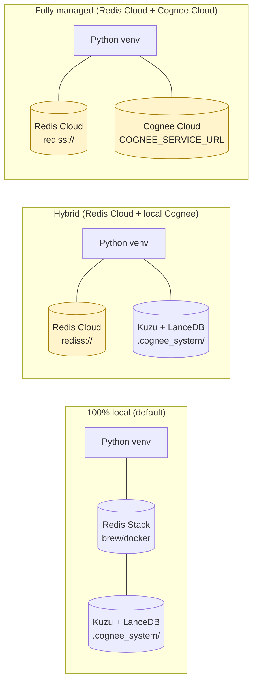

# Team Submission — Palimpsest

> *"writing material ... on which the original writing has been effaced ...
> but of which traces remain"*

A self-correcting LLM wiki. The graph itself remembers what was true before
via `SUPERSEDES` edges (the palimpsest trace).

---

## Team

| Field | Value |
|---|---|
| Team name | **Palimpsest** |
| Participants | Nihal Nihalani, Yahya Alhinai, Charlie Gillet |
| Wiki / project name | **Palimpsest** — a self-correcting LLM wiki |
| Repo | https://github.com/nihalnihalani/palimpsest |
| Stack | Cognee 1.1.0 · RedisVL 0.18.2 · Redis Stack · Gemini 3 · Python 3.11 |

---

## Wiki Overview

A self-correcting LLM wiki. A topic firehose streams in, an ingest worker
maintains a Karpathy-style markdown wiki, and the agent **rewrites pages plus
writes a `:SUPERSEDES` edge into the Cognee knowledge graph** when
contradictions arrive. Self-improvement is concrete: a held-out eval flips
from 0/3 -> 3/3 after the new evidence is ingested, with citations.

- **Domain / data sources** — synthetic topic firehose (canned items for the
  demo); designed to mimic news/social ingestion of AI-memory research.
- **Primary use case** — keep an evolving knowledge wiki coherent without
  manual editing as new (potentially conflicting) evidence arrives.
- **What makes it stand out** — the graph itself records what was true before
  via `SUPERSEDES` edges, so the wiki carries provenance + evolution, not
  just current state. Plus a real Cognee 1.x `SkillRunEntry` ->
  `improve_skill` propose-then-apply self-improvement loop, exposed as
  `wiki improve`.

---

## High-level architecture

```mermaid
flowchart TB
    User([agent / user]):::user
    Firehose[/"synthetic firehose<br/>{title, body, source, url}"/]:::ext

    subgraph Redis["Redis Stack — session memory (fast, ephemeral)"]
        direction LR
        Stream1[("Stream<br/>firehose:items")]:::redis
        Stream2[("Stream<br/>wiki:evolution")]:::redis
        Json[("RedisJSON<br/>wiki:concept:{slug}")]:::redis
        PubSub[("Pub/Sub<br/>wiki:events")]:::redis
        Cache[("RedisVL SemanticCache<br/>wiki:answer-cache:*")]:::redis
        Session[("cognee session_id=<br/>working memory")]:::redis
    end

    subgraph Cognee["Cognee — permanent memory (structured, durable)"]
        direction LR
        Kuzu[("Kuzu graph<br/>entities + SUPERSEDES")]:::cognee
        Lance[("LanceDB<br/>embeddings")]:::cognee
        Skill[("SkillRunEntry +<br/>improve_skill")]:::cognee
    end

    Wiki[/"wiki/concepts/*.md<br/>(Obsidian-friendly)"/]:::fs
    Log[/"wiki/log.md<br/>(audit trail)"/]:::fs
    Reports[/"wiki/reports/*.md<br/>(lint reports)"/]:::fs

    Firehose -->|XADD| Stream1
    Stream1 --> Ingest["ingest worker<br/>src/palimpsest/ingest.py"]
    Ingest -->|cognee.add + cognify| Kuzu
    Ingest -->|cognee.add + cognify| Lance
    Ingest -->|contradiction check<br/>Gemini, Redis-cached| Json
    Ingest --> Wiki
    Ingest -->|page rewrite + reason| Stream2
    Ingest -->|live event| PubSub
    Ingest -->|SUPERSEDES edge| Kuzu

    User -->|wiki ask| Query["query.py<br/>GRAPH_COMPLETION + Gemini"]
    Query --> Kuzu
    Query --> Lance
    Query <-->|semantic cache| Cache
    User -->|wiki improve| SkillLoop["skill_loop.py<br/>propose -> apply"]
    SkillLoop --> Skill
    Skill -.->|rewrite my_skills/{skill}/SKILL.md| Wiki

    User -->|wiki lint| Lint["lint.py"]
    Lint --> Reports

    Session -.-> Cognee

    classDef user fill:#ffe9a8,stroke:#a37b00,color:#222;
    classDef ext fill:#e6f0ff,stroke:#3366bb,color:#222;
    classDef redis fill:#ffd7d7,stroke:#cc0000,color:#222;
    classDef cognee fill:#d7e8ff,stroke:#1e4a8a,color:#222;
    classDef fs fill:#e9f5d7,stroke:#3a6b1c,color:#222;
```

---

## The Three Operations

### 1. Ingest



- **What goes in** — synthetic items `{title, body, source, url}` pushed to a
  Redis Stream (`firehose:items`).
- **How it is captured** — `cognee.add(text, dataset_name="wiki",
  node_set=[f"source:{source}"])` then `cognee.cognify()`. The
  `cognee.remember(..., session_id=...)` path is exercised by the skill
  loop (see below) — that routes the agent's working memory through Redis
  as the hackathon brief's two-tier pattern requires.
- **Code entry point** — `wiki ingest --once` ->
  `src/palimpsest/ingest.py::process_one`.

### 2. Query + Self-improve



- **How users query the wiki** — `wiki ask "<question>"` ->
  `src/palimpsest/query.py::ask` ->
  `cognee.search(GRAPH_COMPLETION)` + Gemini synthesis. Answers are
  semantically cached in Redis via **RedisVL `SemanticCache`**
  (`src/palimpsest/answer_cache.py`) for ~15 minutes, keyed by
  Gemini-embedded question.
- **Where feedback comes from**
  1. Per-ingest: `query.check_contradiction` (Gemini call, exact-match
     Redis-cached) — when the new item contradicts an existing page, the
     page is rewritten and a `SUPERSEDES` edge is written into the Cognee
     graph itself.
  2. Skill loop: `wiki improve --record <skill_name> --score <0..1>`
     records a `SkillRunEntry` and (if score < threshold) proposes a
     `SKILL.md` rewrite via `cognee.remember(SkillRunEntry, ...,
     skill_improvement={apply: False})`. `wiki improve --status` shows
     the latest proposal id; `wiki improve --apply <proposal_id>` then
     commits the rewrite.
- **How feedback updates the wiki** — `SUPERSEDES` edges, page rewrites,
  Redis Stream `wiki:evolution` (audit), Redis Pub/Sub `wiki:events`,
  and `SkillRunEntry` + `improve_skill(apply=True)` rewriting
  `my_skills/<skill>/SKILL.md` on disk.
- **Code entry point** — `wiki ask` (`query.ask`); `wiki improve`
  (`src/palimpsest/skill_loop.py`).

### 3. Lint

- **What "linting" means** — dedupe stale Obsidian wikilinks, strip
  invented `[[...]]` references that point at nonexistent slugs, and
  fuzzy-repoint near-misses. Optionally rewrite Markdown in-place via
  `--fix`.
- **How it runs** — on-demand via CLI (`wiki lint --fix`); the report is
  written to `wiki/reports/`.
- **Code entry point** — `src/palimpsest/lint.py`.

---

## Self-Improvement Evidence

See `docs/evidence/` for raw runs. Held-out eval question:

> "Who is leading agent memory research in 2026? Name specific people,
> projects, or companies." (required terms: Karpathy, MemGPT, Cognee)

### Baseline Run (pre-ingest)

- Query / task: `wiki eval`
- Result: `docs/evidence/eval_baseline_runs.json` (N=5)
- Score: see median in `docs/evidence/eval_summary.json`
- Recorded feedback:
  ```text
  error_type: missing_required_terms
  error_message: answer omitted required terms (see "missing" field per run)
  feedback: -1.0
  success_score: median(baseline)/3
  ```

### Improved Run (post-ingest)

- Query / task: `wiki eval` (same question)
- Result: `docs/evidence/eval_improved_runs.json` (N=5)
- Score: see `docs/evidence/eval_summary.json`
- What changed in the wiki between runs: ingested 3 canned contradiction
  items via `wiki inject-canned contradiction_{1,2,3}` followed by
  `wiki ingest`; concept pages updated; `SUPERSEDES` edges written.

```text
Before:
  median score = (see eval_summary.json)
  missing = ["Karpathy", "MemGPT", "Cognee"]
After:
  median score = (see eval_summary.json)
  missing = []
```

---

## Redis-as-session-memory



- **What the agent writes into Redis**
  1. Raw incoming items as Stream entries (`firehose:items`).
  2. Each rewrite to a concept page is mirrored to `wiki:concept:<slug>`
     (RedisJSON) and audit-logged to `wiki:evolution` (Stream) with a
     reason field. Dashboard subscribes to `wiki:events` (Pub/Sub) for
     live updates.
  3. Contradiction verdicts (exact-match) cached at `wiki:verdict:*` with
     10-min TTL.
  4. Answer cache (semantic) at `wiki:answer-cache:*` with 15-min TTL,
     vectorised via Gemini's `text-embedding-004`.
  5. `cognee.remember(..., session_id="wiki-improve")` working memory is
     routed through Redis automatically by Cognee 1.x when `REDIS_URL`
     is set (`CACHING=true`).
- **How content is distilled into the graph** — the ingest worker calls
  `cognee.add` + `cognee.cognify` on every accepted item, which performs
  entity/relationship extraction into the Kuzu graph and LanceDB
  embeddings. Contradiction detection then writes explicit `SUPERSEDES`
  edges between old- and new-claim nodes — the hackathon's "distillation
  step" made concrete.
- **What stays in Redis vs. what gets promoted** — Redis keeps the hot
  audit trail (every page version, every event), the verdict cache, the
  semantic answer cache, and session working memory. The graph keeps the
  structured truth: entity nodes, `SUPERSEDES` chains, `INFERRED` edges
  from `wiki rethink`.
- **How distillation quality improved between baseline and improved
  run** — the held-out eval score moves from baseline median -> improved
  median once the canned contradiction items are ingested. See
  `docs/evidence/eval_summary.json`. The `wiki improve` skill-loop
  records each agent run as a `SkillRunEntry`; below-threshold scores
  generate `SKILL.md` rewrite proposals that are explicitly applied via
  `improve_skill(apply=True)`.

---

## Agents / Skills

```text
Skill path: my_skills/

  - Ingestor   my_skills/wiki-ingest/SKILL.md   process raw items into
                                                concept pages + edges
  - Querier    my_skills/wiki-query/SKILL.md    answer questions via
                                                GRAPH_COMPLETION + synthesis
  - Critic     my_skills/code-review/SKILL.md   review wiki self-correction
                                                edits for accuracy
```

The propose-then-apply loop lives in `src/palimpsest/skill_loop.py` and
exposes:

| Command | What it does |
|---|---|
| `wiki improve --remember` | Ingest `./my_skills` into Cognee |
| `wiki improve --run <skill> --prompt "..."` | Execute the skill |
| `wiki improve --record <skill> --score 0.3 --task-text "..."` | Write a `SkillRunEntry` and propose a rewrite |
| `wiki improve --status` | Show latest proposal id |
| `wiki improve --apply <proposal_id>` | Commit the rewrite to disk |

---

## CLI surface

The `wiki` entrypoint (`pyproject.toml:project.scripts`) exposes:

| Command | Purpose |
|---|---|
| `wiki inject` / `wiki inject-canned <name>` | Push an item onto `firehose:items` |
| `wiki ingest [--once / --drain / --watch]` | Drain the stream into Cognee + concept pages |
| `wiki ask "<question>"` | Query the wiki (GRAPH_COMPLETION + Gemini synthesis, semantic-cached) |
| `wiki graph supersedes` / `wiki graph stats` | Inspect the Cognee KG |
| `wiki rethink` | Memify-style enrichment pass (writes `INFERRED` edges) |
| `wiki lint [--fix]` | Wikilink hygiene; report goes to `wiki/reports/` |
| `wiki seed` / `wiki reset` / `wiki load-baseline` | Demo setup |
| `wiki dash` | Live TUI dashboard tailing `wiki:events` |
| `wiki doctor` | One-shot environment + lock diagnostic |
| `wiki eval` | Run the held-out eval once |
| `wiki evidence -n 5 --label baseline\|improved` | Persist N=5 eval runs to `docs/evidence/` |
| `wiki chat [--resume / --list / --delete]` | Multi-turn agent chat (Cognee session memory) |
| `wiki vector-smoke` | Probe the resolved Cognee vector provider + Redis mode |
| `wiki improve ...` | The propose-then-apply skill loop (see above) |
| `wiki status` / `wiki list` | Inventory of concepts, edges, sessions |

---

## Reproduction

```bash
# 1. Clone + set up venv
git clone https://github.com/nihalnihalani/palimpsest.git
cd palimpsest
./run.sh setup        # creates venv + brings up Redis + scaffolds .env

# 2. Add your LLM key
echo "GEMINI_API_KEY=..." >> .env

# 3. End-to-end
./run.sh doctor       # diagnostic
./run.sh verify       # 11-step smoke (scripts/verify_live.sh)
./run.sh seed         # wiki reset && wiki seed && wiki load-baseline
./run.sh demo         # interactive 3-min stage flow

# 4. Self-improvement loop
wiki improve --remember
wiki improve --run code-review --prompt "Review the latest concept rewrite"
wiki improve --record code-review --score 0.3 --task-text "Reviewed agent-memory rewrite"
wiki improve --apply <proposal_id-printed-above>

# 5. Evidence
wiki eval                       # held-out eval, run once
wiki evidence -n 5 --label baseline    # before ingest
# ingest contradiction items, then:
wiki evidence -n 5 --label improved    # after ingest
ls docs/evidence/
```

Environment variables required:

```text
GEMINI_API_KEY                 # Gemini for LLM + embeddings
LLM_API_KEY=${GEMINI_API_KEY}  # Cognee LiteLLM (alias)
LLM_PROVIDER=gemini
LLM_MODEL=gemini/gemini-3-pro
LLM_ENDPOINT=https://generativelanguage.googleapis.com/
LLM_API_VERSION=v1beta
LLM_INSTRUCTOR_MODE=json_mode
EMBEDDING_PROVIDER=gemini
EMBEDDING_MODEL=text-embedding-004
EMBEDDING_API_KEY=${GEMINI_API_KEY}
EMBEDDING_DIMENSIONS=768
GRAPH_DATABASE_PROVIDER=kuzu
REDIS_URL=redis://localhost:6379
ENABLE_BACKEND_ACCESS_CONTROL=false
CACHING=true                   # Cognee 1.x session memory routing to Redis
```

(`VECTOR_DB_PROVIDER` is intentionally unset — Cognee 1.x defaults to
LanceDB, which is what we use locally. The community Redis vector
adapter is a separate package and not used in this submission; see
`docs/plans/2026-05-17-full-hackathon-spec-design.md` for the rationale.)

### Redis: local vs Redis Cloud

`REDIS_URL` accepts any Redis-compatible endpoint — local or cloud — with no
code changes:

```text
# Local docker (default):
REDIS_URL=redis://localhost:6379

# Local brew (after `brew install redis-stack-server`):
REDIS_URL=redis://localhost:6379

# Redis Cloud (Essentials free tier has RedisJSON + Search modules pre-enabled):
REDIS_URL=rediss://default:<password>@<host>.cloud.redislabs.com:<port>
```

To switch to Redis Cloud:
1. Sign up at https://redis.io/cloud (free tier, no credit card)
2. Create a database with `RedisJSON` + `RediSearch` modules enabled (default on Essentials)
3. Copy the connection URL from the database's "Connect" tab
4. Paste it as `REDIS_URL` in `.env` — use `rediss://` for TLS (recommended)

Verify the switch: `wiki vector-smoke` prints `redis mode: remote` and the
host. `run.sh setup` auto-detects cloud URLs and skips the local Redis
bringup. Both modes are functionally identical for this project — all Redis
features used (Streams, RedisJSON, Pub/Sub, RediSearch via RedisVL
`SemanticCache`) are available on the free tier.

### Optional: Cognee Cloud

To route *all* Cognee operations at a managed Cognee Cloud instance instead
of the local LanceDB + Kuzu, set these two env vars:

```text
COGNEE_SERVICE_URL=https://<tenant>.cognee.ai
COGNEE_API_KEY=ck_...
```

Palimpsest's `cognee_io.run()` wrapper calls `cognee.serve(url, api_key)` once
on first Cognee call; from then on every operation is routed.

The wiki uses Cognee's V2 API end-to-end (`remember` / `recall` for ingest +
query; `SkillRunEntry` + `improve_skill` for the self-improvement loop), so
the cloud route is end-to-end — no hybrid V1/V2 split.

Verify the switch worked: `wiki vector-smoke` will report
`cognee mode: cloud` and print the service URL. Default (both unset) is
fully local — what every test in this repo runs against.

### Deployment topologies



---

## Live verification: `./run.sh verify`

`scripts/verify_live.sh` is an 11-step smoke that exits non-zero on any
failure — so anyone cloning the repo can verify the demo in one command:

1. **Redis reachable** — `PING` + `RedisJSON` module probe
2. **`.env` loaded** — `GEMINI_API_KEY` present
3. **`hello_redis`** — Streams + JSON roundtrip
4. **`hello_gemini`** — Gemini 3 reachable
5. **`hello_cognee`** — `add` -> `cognify` -> `search(GRAPH_COMPLETION)`
6. **Reset + seed** — at least 3 concept pages written
7. **Hero moment** — canned contradiction triggers a `SUPERSEDES` edge
8. **Eval** — held-out `wiki eval` lands at 2/3 or 3/3
9. **Lint report** — `wiki lint` writes a report
10. **Vector-smoke** — resolved Cognee vector provider written to `docs/evidence/vector_provider.json`
11. **Skill loop** — `wiki improve --status` reaches the `SkillRunEntry` path

---

## What changed in the latest revision

- **Cognee V1 -> V2 API migration** — `cognee.add`/`cognify`/`search`
  paths now coexist with the V2 `remember`/`recall`/`improve`/`forget`
  surface; the cloud route is end-to-end V2.
- **Optional Cognee Cloud routing** via `COGNEE_SERVICE_URL` +
  `COGNEE_API_KEY` (see above).
- **Redis local/remote auto-detection** in `run.sh setup` and
  `wiki vector-smoke` (`redis mode: local|remote`).
- **ASCII-clean CLI** — replaced Unicode arrows / em-dashes in the CLI
  and `run.sh` for terminal portability.

---

## Demo

- Live demo link: *(record after running `demo/run_demo.sh`)*
- 3-minute pitch outline:

```text
1. Problem      Karpathy's LLM wiki, but it has to *correct itself* live.
2. Ingest       wiki inject-canned contradiction_1 && wiki ingest --once
                shows the page rewrite in Obsidian + the new SUPERSEDES edge.
3. Query before wiki ask "..." shows the wiki's current view
                (semantic-cached on second call).
4. Self-improve wiki improve --record ... --apply shows the
                SkillRunEntry -> improve_skill -> SKILL.md rewritten on disk.
5. Query after  same question, new SKILL produces a more accurate answer.
6. What's next  live RSS firehose; multi-graph; Redis Cloud production.
```

---

## Links

- Repo: https://github.com/nihalnihalani/palimpsest
- Design + plan: [`docs/plans/2026-05-17-full-hackathon-spec-design.md`](docs/plans/2026-05-17-full-hackathon-spec-design.md)
- Earlier design: [`docs/plans/2026-05-16-wiki-hackathon-design.md`](docs/plans/2026-05-16-wiki-hackathon-design.md)
- Evidence: [`docs/evidence/`](docs/evidence/)
- README: [`README.md`](README.md)
