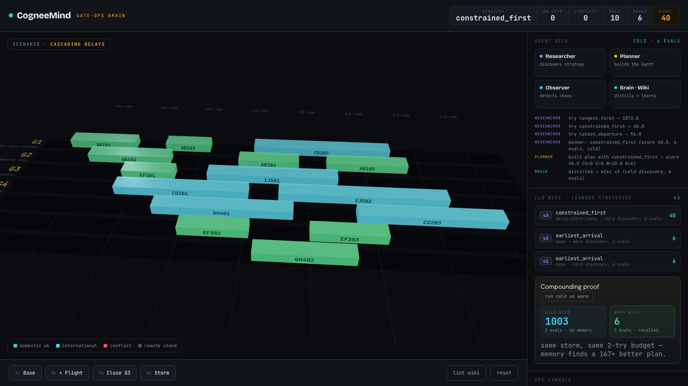

# CogneeMind — Airport Gate-Ops Brain

A self-improving Company Brain (Cognee Cloud Hackathon) that assigns airport
gates **and discovers its own assignment algorithm**, getting better the more
disruptions it sees. Three agents — **Researcher / Planner / Observer** — share
an LLM wiki; the Researcher warm-starts each search from what the wiki already
learned, so discovery **compounds**: fewer evaluations and better plans over time.

> Lower score = better plan. `Score = 1000·U + 500·C + 1·W + 5·R`
> (U=no-gate, C=conflicts, W=walking, R=reassignments)



## What's inside

```
backend/
  simulator.py    # gate assignment (greedy by strategy) + scoring
  disruptions.py  # add_flight / close_gate / apply_delays + signatures
  agents.py       # Researcher (warm-start discovery) / Planner / Observer + optimize()
  memory.py       # LocalWiki: recall priors, distill winners + dead-ends, lint
  brain.py        # Cognee integration: ingest, SkillRunEntry propose->apply, distill
  api.py          # FastAPI + WebSocket (/scenario, /chat, /compounding, /events)
  evidence.py     # prints + writes the before/after evidence
  test_cognee.py  # standalone proof of the Cognee loop (ingest->improve->recall)
  my_skills/      # researcher | planner | observer | linter  (SKILL.md each)
  data/           # gates.json, flights.json, rules.md
frontend/
  src/Gantt3D.tsx       # three.js / r3f Gantt (glowing bars over a grid deck)
  src/GanttFallback.tsx # 2D Gantt if WebGL is unavailable
  src/GanttStage.tsx    # WebGL detection + error boundary -> 3D or 2D
  src/App.tsx           # ops-deck UI: readout, agent deck, wiki timeline, chat
```

## Run it (two terminals)

**Terminal 1 — backend** (Python 3.10–3.14). First time only:
```bash
cd backend
uv venv && uv pip install --python .venv/bin/python fastapi "uvicorn[standard]"
# optional but recommended — turns on the Cognee brain:
uv pip install --python .venv/bin/python cognee==1.2.0.dev1
```
Add your key to `backend/.env` (auto-loaded; gitignored):
```
LLM_API_KEY=sk-...
```
Then start it (wait ~25–30s for `cognee ready — ingested rulebook + 4 skills`):
```bash
.venv/bin/python -m uvicorn api:app --port 8077
```

**Terminal 2 — frontend**:
```bash
cd frontend && npm install && npm run dev
```
Open the URL Vite prints (e.g. **http://localhost:5173**).

> No `.env`/Cognee? It still runs **fully** on the local wiki — boots instantly,
> same demo. Cognee just adds the durable graph + skill self-rewrite on top.

## Demo flow
Click **Base → +Flight → Close G3 → Storm** and watch the **Agent Deck** narrate
the loop (Observer flags chaos → Researcher discovers → Planner heals) while the
Gantt heals to green. Then hit **run cold vs warm** in the Compounding card.

| Step | Score | Point at |
|------|-------|----------|
| Base | 6 (U=0) | calm opening plan |
| + Flight | 70 (U=0) | naive would strand it; brain heals |
| Close G3 | 31 (U=0) | reuses learned strategy, no re-search |
| Storm | 36 (U=0) | bars shift in time, heals again |
| **cold vs warm** | **1003 → 6** | same storm, same 2-try budget — memory wins |

Type in the **Ops Console**: `close G3`, `storm`, `add flight 09:15`,
`what is the best strategy?` (the last shows a live `[cognee recall: …]`).

## Evidence (no server needed)
```bash
cd backend && python evidence.py     # -> data/evidence.json
```
- **Self-improvement:** storm under naive `earliest_arrival` strands a flight
  (**1003**) → discovered `latest_departure` (**6**, all gated).
- **Compounding:** same storm, 2-try budget — cold **1003** vs warm **6**;
  full-budget cold needs **6** evals to reach what warm finds in **2**.

## Cognee — verified working
With `LLM_API_KEY` set, the full judged loop runs against a local
cognee 1.2.0.dev1 graph (verified live):
- **Ingest** rulebook + 4 skills (`content_type="skills"`).
- **Agentic search** reasons over skills + graph (`SearchType.AGENTIC_COMPLETION`).
- **Self-improve** — a stranded-flight failure records `SkillRunEntry(success=0.0)`;
  a proposal is generated and **applied** via `improve_skill(apply=True)`
  (`{'applied': True, 'skill': 'researcher'}`).
- **Distill + recall** — winners → permanent graph (no `session_id`); raw trials →
  session memory (`session_id=run-…`). `cognee.recall(...)` returns the learned strategy.

Prove it standalone: `cd backend && .venv/bin/python test_cognee.py`.

## How it maps to the hackathon
- **Ingest** — rules + skills into the brain.
- **Query + self-improve** — score each run → `SkillRunEntry` proposes a skill
  rewrite → `improve_skill(apply=True)`.
- **Lint** — dedupe/prune/conflict-resolve the wiki (`/lint`).
- **Two tiers** — raw trials in session memory; winning strategies +
  disruption→strategy index + dead-ends distilled into the permanent graph.

See `SUBMISSION.md` for the filled-in template and reproducible numbers.

## Troubleshooting
- **`Could not set lock on file … Lock is held by PID`** — only one backend can
  use the local Cognee graph at a time. A previous server is still alive:
  `pkill -9 -f "uvicorn api:app"`, then start again.
- **Blank 3D area** — WebGL unavailable; it auto-falls back to the 2D Gantt.
- **`recomputing…` stuck / brain not ready** — backend still ingesting (~30s on
  boot) or not started; check Terminal 1.
